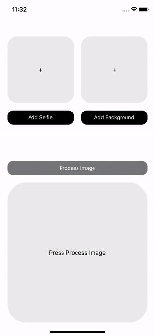

<div align="right">

</div>

# react-native-image-selfie-segmentation

Uses [**MLKit Vision** Selfie Segmentation](https://developers.google.com/ml-kit/vision/selfie-segmentation) to combine
a selfie and background image.

## Installation

```sh
npm install react-native-image-selfie-segmentation
cd ios && pod install
```

## Usage

```js
import { replaceBackground } from 'react-native-image-selfie-segmentation';

// ...

const response = await replaceBackground(inputImage, backgroundImage, 500);
```

## Props

| Prop             | Type   | Definition                                                                                      |
|------------------|--------|-------------------------------------------------------------------------------------------------|
| Input Image      | String | Required - File URI: The selfie image                                                           |
| Background Image | String | Required - File URI: The background image               |
| Max Size         | Number | Optional - Default: 500. This will resize the input and background images to the required value. |

**Max Size Notes**

* The background image is resized to the max size value, then cropped from the center to fill the input image height/width.

* On iOS Retina devices, Max Size is doubled, so a value of 250 with an input of 1000x800 will result in a 500x400 image.
You can account for this by passing a value half of what is required.


## Response

| Response | Type          | Definition                  |
|----------|---------------|-----------------------------|
| Image    | String | A File URI of the new image |

## Example

```js
const [image, setImage] = useState();
const [inputImage, setInputImageUri] = useState();
const [backgroundImage, setBackgroundImage] = useState();

// ... set the inputImageUri and backgroundImageUri
// ... check the example which uses react-native-image-picker

const onProcessImageHandler = async () => {
  if (inputImage && backgroundImage) {
    await replaceBackground(inputImage, backgroundImage, 400)
      .then((response) => {
        setImage(response);
      })
      .catch((error) => {
        console.log(error);
      });
  }
};

return (
  <>
    <TouchableOpacity onPress={onProcessImageHandler}>
      <Text>Process Image</Text>
    </TouchableOpacity>
    {image && (
      <Image source={{ uri: image }} />
    )}
  </>

);

```

## Contributing

See the [contributing guide](CONTRIBUTING.md) to learn how to contribute to the repository and the development workflow.

## License

MIT
